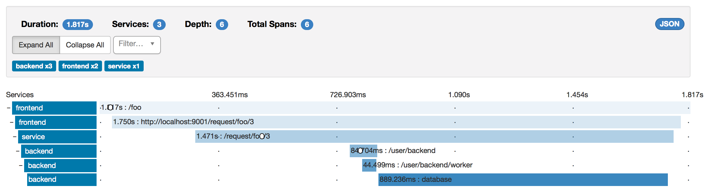

# Cinnamon Akka Http tracing sample

Sample project for tracing through an Akka Http frontend, another Akka Http service, and a remote Akka backend.

This is an Akka Http version of the [Cinnamon Play tracing sample].

[Cinnamon Play tracing sample]: https://github.com/pvlugter/cinnamon-play-tracing

## Credentials file

First make sure you have credentials set up for Lightbend Reactive Platform. You can find your username and password under your [Lightbend account].

Create a `~/.lightbend/commercial.credentials` file with:

```
realm = Bintray
host = dl.bintray.com
user = <username>
password = <password>
```

[Lightbend account]: https://www.lightbend.com/product/lightbend-reactive-platform/credentials


## Running the sample

Start up Zipkin standalone:

```
docker run -d --name zipkin -p 9411:9411 openzipkin/zipkin
```

Start the Akka backend:

```
sbt backend/run
```

Start the Akka Http service:

```
sbt service/run
```

Start the Akka Http frontend:

```
sbt frontend/run
```

Make a request on the frontend, such as:

```
http localhost:9000/foo
```

Traces will be reported to Zipkin at:

[http://localhost:9411/zipkin/](http://localhost:9411/zipkin/)

Here's an example cross-service trace:


